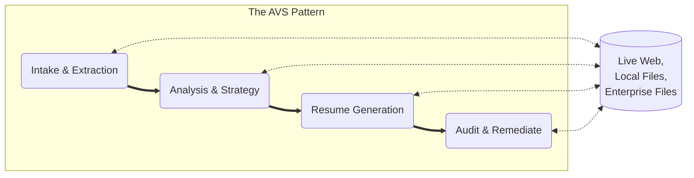

# Agentic Value Stream (AVS) Orchestration: The Force Multiplier of Human Knowledge and Skill

Welcome to the home of the Agentic Value Stream (AVS) framework. We provide the infrastructure and logic blueprints required to transform raw AI potential into repeatable, high-fidelity business value.

# 🎯 Who is this for?

| Persona | Your Goal | Where to Start |
| :--- | :--- | :--- |
| **Practitioners (Alex)**<br>*Senior TPMs, Release Train Engineers* | "I want to automate my status reporting, compliance checks, and kill administrative busywork." | [**🚀 AVS Toolkit**](avs-toolkit/README.md)<br>*The CLI Engine for automation.* |
| **Leaders (Jordan & Casey)**<br>*Directors of PMO, Executives* | "I want to visualize organizational risk, improve velocity, and see the ROI of AI." | [**🧠 Agentic Governance**](my-job-hunt/docs/Agentic-Governance.md)<br>*The Strategy & Heat Map Guide.* |

# 🛡️ Core Mission: Ending "Context Blindness"

The biggest friction point in modern AI is not model intelligence—it is **context blindness**. Agents fail because they lack the implicit knowledge and expert instructions required to perform a task without hallucination.

AVS-Orchestration solves this by treating every unit of work as a **Value Story**: a self-contained "Briefcase" of context, goal-alignment, and algorithmically legible steps.

## 🏗️ The Ecosystem: A Three-Pillar Architecture

To ensure scalable **Agentic Value Streams**, the framework is structured into three distinct layers of governance, execution, and logic.

### 1. AVS Toolkit (The Enterprise Engine)
The Toolkit is a high-performance Python-based CLI and orchestration engine designed for professional-grade reliability.
* **Modern Dependency Management**: Built on the **`uv` package manager**, ensuring deterministic, lightning-fast environments and isolated execution for every Agentic flow.
* **The Lifecycle**:
    * **Validate**: Cross-references logic against the **AVS Building Code** (Policy-as-Code).
    * **Assemble**: Aggregates a "Context Briefcase" using Model Context Protocol (MCP) and local RAG.
    * **Run**: Orchestrates reasoning via local models (Ollama) or secure cloud endpoints.

### 2. AVS Standard Library (Governance & Logic Blueprints)
The Library serves as the "Institutional Memory" for the organization.
* **Pre-Audited Streams**: A community and enterprise-contributed collection of production-ready logic streams (e.g., Strategic Research, Technical Auditing).
* **Interoperability**: Every story follows a standardized AVS schema, ensuring that any agent can "read" and build upon the output of a previous agent.

### 3. AVS Private Workspace (Sovereignty & Security)
The Workspace is the physical implementation of **Data Sovereignty**. It ensures that your most sensitive "Agentic reasoning" and "Private data" never leave your controlled environment.

#### Workspace Physical Model:
```text
my-avs-workspace/                      <-- Your Private Root
├── .env                               <-- Your API Keys (Secrets)
├── avs-toolkit/                       <-- Cloned Toolkit (For updates & reference)
├── avs-standard-library/              <-- Cloned Library (The Blueprints)
│
└── my-active-project/                 <-- YOUR WORK HAPPENS HERE
    ├── inputs/                        <-- Your Resumes, Data, Transcripts
    ├── outputs/                       <-- The Agent's Results
    └── private-stories/               <-- Custom Value Stories you build
```

> **💡 Alex's Tip on Installation:** When you install the toolkit "Global System-Wide" (Option A), the `avs` command becomes a permanent part of your computer. You keep the `avs-toolkit/` folder in your workspace so you can easily run `git pull` to get future updates from Patrick.

## 🔄 The Digital Thread

AVS uses a cumulative value model where the product of one story becomes the context for the next, enabling a multiplied, Human-In-The-Loop (HITL), seamless flow of **Expert Agency** across the enterprise.



## 📈 Strategic Value (For Executives)

By adopting AVS-Orchestration, the enterprise realizes value across three key vectors:

| Feature | Business Impact | ROI Metric |
| :--- | :--- | :--- |
| **Local-First Execution** | Zero IP leakage; bypasses expensive third-party token costs for sensitive data. | **Risk & Cost Reduction** |
| **Agentic Continuity** | Eliminates "Context Blindness," allowing agents to pick up where experts left off. | **80% Reduction in Rework** |
| **`uv` Powered Engine** | Rapid deployment of agents without "Dependency Hell" or environment drift. | **Accelerated Time-to-Value** |

## ⚡ Operational Value (For Practitioners)

For the TPMs and Engineers on the ground:

*   **Reclaim 15 Hours/Week:** Automate the "information hunt" for status updates and dependency checks.
*   **Compliance-as-Code:** Run audits against your own standards instantly, instead of waiting for a manual review.
*   **Kill the "Blank Page":** Generate high-fidelity drafts (Strategy, Resumes, Analysis) in seconds using proven blueprints.

## 🏛️ Principles of Sovereignty

- **Local-First**: We prioritize local execution on your workstation (Mac Studio/PC) to ensure sensitive data remains under your control.
- **Algorithmically Legible**: We externalize tacit human knowledge into instructions that agents can follow with forensic precision.
- **Hybrid Intelligence**: We bridge the gap between high-reasoning cloud models and high-privacy local models.
- **High-Velocity Python**: By standardizing on uv, we ensure that the Agentic Value Stream is as stable and reproducible as a traditional manufacturing line.

## 🤝 Get Involved & Implementation Support

Are you looking to implement **Agentic Value Streams** to scale your internal expertise or optimize enterprise workflows? 

* **Architects**: Help us expand the **Standard Library** by contributing new "Value Stories" and logic blueprints.
* **Developers**: Contribute to the **AVS Toolkit** core. We prioritize modern Python standards and `uv`-based workflows.
* **Enterprise Leaders**: I am **open to opportunities** to help organizations design, customize, and deploy AVS frameworks to bridge the gap between AI potential and business ROI.

### Connect with the Creator
[](https://www.linkedin.com/in/patrickheaney/)

**Framework by Patrick Heaney.** *Bridging the gap between latent expert knowledge and autonomous execution.* Licensed under [CC BY-SA 4.0](https://creativecommons.org/licenses/by-sa/4.0/).