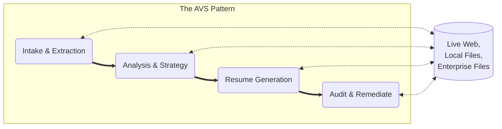

# Agentic Value Stream (AVS) Orchestration: The Force Multiplier of Human Knowledg and Skill

Welcome to the home of the Agentic Value Stream (AVS) framework. We provide the infrastructure and logic blueprints required to transform raw AI potential into repeatable, high-fidelity business value.

# 🛡️ Core Mission: Ending "Context Blindness"

The biggest friction point in modern AI is not model intelligence—it is context blindness. Agents fail because they lack the implicit knowledge and expert instructions required to perform a task without hallucinating.

AVS-Orchestration solves this by treating every unit of work as a Value Story: a self-contained "Briefcase" of context, goal-alignment, and algorithmically legible steps.

## 🏗️ The Ecosystem

Our framework is split into three primary pillars:

### 1. AVS Toolkit (The Engine)

The Engine is a Python-based CLI that manages the lifecycle of a Value Story.

- **Validate**: Checks logic against the AVS Building Code.

- **Assemble**: Performs the "Information Hunt" (Web research, Local files, MCP pulls).

- **Run**: Dispatches context to local models via Ollama for 100% data sovereignty.

### 2. AVS Standard Library (Open Source Value Stories)

The Library is a community-driven collection of production-ready logic streams.

- **Job Hunting**: Automated, audited resume tailoring.

- **Research**: Company intelligence from public and enterprise sources.

- **Templates**: Standardized starters for building your own streams.

### 3. AVS Private Workspace

The Workspace organizes it all to main data soverenty and seperation of ownership.  The example below 
```text
AVSO-Private-Workspace/                         <-- Workspace root
├── .env                                        <-- Global API Keys
├── avs-toolkit/                                <-- THE ENGINE (Git Repo)
├── avs-standard-library/                       <-- THE OPEN SOURCE VALUE STORIES (Git Repo)
│
└── my-job-application-value-stream project/    <-- YOUR PROJECT FOLDER (Create this on your Local Computer or Enterprise Tool)
    ├── inputs/                 
    │   └── raw-resume.md                       <-- Your master data
    ├── outputs/                
    │   └── oracle-tpm-role/                    <-- Results generated here for each executeion of an AVS
    └── private-value-stories/                  <-- Your private tailored value-story library for this AVS.
```

## 🔄 The Digital Thread

AVS uses a cumulative value model where the product of one story becomes the context for the next, enabling a multiplied, Human-In-The-Loop (HITL), seamless flow of **Expert Agency** across the enterprise.



## 🏛️ Principles of Sovereignty

Local-First: We prioritize local execution on your workstation (Mac Studio/PC) to ensure your sensitive data never leaves your control.

Algorithmically Legible: We externalize tacit human knowledge into instructions that agents can follow with forensic precision.

Hybrid Intelligence: We bridge the gap between high-reasoning cloud models and high-privacy local models.

## 🤝 Get Involved

Architects: Contribute new Value Stories to the Standard Library.

Developers: Help us harden the Toolkit core.

Framework by Patrick Heaney. Licensed under CC BY-SA 4.0.
